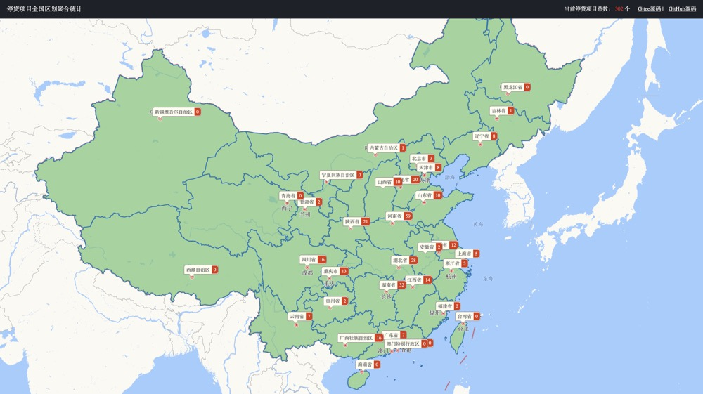

# map-of-loan-suspension

停贷项目全国区划聚合统计

数据来源：https://github.com/WeNeedHome/SummaryOfLoanSuspension

技术栈：`Vue.js + 高德 Web JS`

在线 demo 预览：https://map-of-loan-suspension.vercel.app

## Usage

node 版本建议 `v14`，避免 node-sass 乱报错

- `npm install`
- `npm run start`

## 声明

本 demo 仅供学习使用，数据都来自网络，不代表真实情况。

- [《WebGIS 入门实战》](https://xiaozhuanlan.com/webgis)
